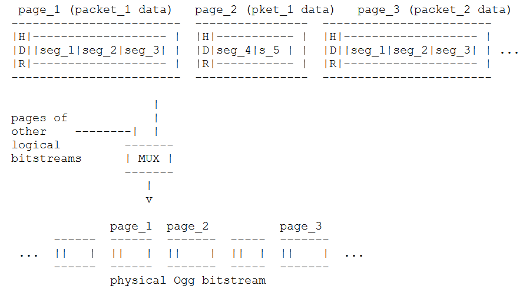
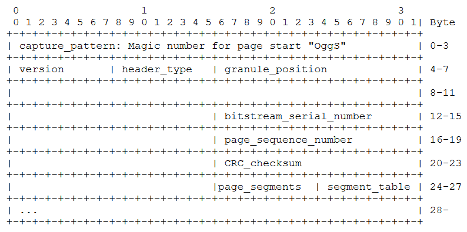
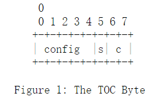
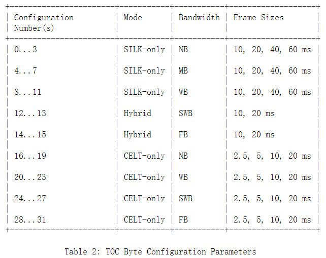
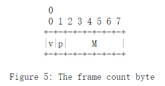
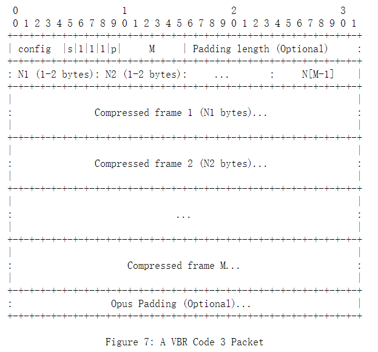

# Ogg and opus format
---
# 1. Ogg container format.
## 1.1 Definitions
The result of an Ogg encapsulation is called the "Physical (Ogg) Bitstream".  It encapsulates one or several encoder-created bitstreams, which are called "Logical Bitstreams".  A logical bitstream, provided to the Ogg encapsulation process, has a structure, i.e., it is split up into a sequence of so-called "Packets".
## 1.2 The Ogg bitstream format
A physical Ogg bitstream consists of multiple logical bitstreams interleaved in so-called "Pages".  Whole pages are taken in order from multiple logical bitstreams multiplexed at the page level.  The logical bitstreams are identified by a unique serial number in the header of each page of the physical bitstream.
   
Each Ogg page contains only one type of data as it belongs to one logical bitstream only.
**Each logical bitstream in a physical Ogg bitstream starts with a special start page (bos=beginning of stream) and ends with a special page (eos=end of stream)**
### 1.2.1 BOS page structure
The bos page contains information to uniquely identify the codec type and MAY contain information to set up the decoding process and information about the encoded media - for example, for audio, it should contain the sample rate and number of channels. By convention, **the first bytes of the bos page contain magic data that uniquely identifies the required codec.** The format of the bos page is dependent on the
codec and therefore MUST be given in **the encapsulation specification of that logical bitstream type.**  Ogg also allows but does not require secondary header packets after the bos page for logical bitstreams

**A physical bitstream begins with the bos pages of all logical bitstreams containing one initial header packet per page, followed by the subsidiary header packets of all streams, followed by pages containing data packets.**
### 1.2.2 Ogg multiplexing
Ogg knows two types of multiplexing: concurrent multiplexing (so-called "Grouping") and sequential multiplexing (so-called "Chaining"). Grouping defines how to interleave several logical bitstreams page-wise in the same physical bitstream. Chaining on the other hand, is defined to provide a simple mechanism to concatenate physical Ogg bitstreams.

In grouping, all bos pages of all logical bitstreams MUST appear together at the beginning of the Ogg bitstream.  The media mapping specifies the order of the initial pages. eos pages for the logical bitstreams need not all occur contiguously.

In chaining, complete logical bitstreams are concatenated.  The bitstreams do not overlap with each other.

The data from the codec comes in order and has position markers (so-called "Granule positions").  Ogg does not have a concept of 'time': it only knows about sequentially increasing, unitless position markers.
## 1.3 The encapsulation process   
**As Ogg pages have a maximum size of about 64 kBytes, Ogg divides each packet into 255 byte long chunks plus a final shorter chunk.**  These chunks are called "Ogg Segments". A group of contiguous segments is wrapped into a **variable** length page preceded by a header. A segment table in the page header tells about the "Lacing values" (sizes) of the segments included in the page. A flag in the page header tells whether a page contains a packet continued from a previous page.  Note that a lacing value of 255 implies that a second lacing value follows in the packet, and a value of less than 255 marks the end of the packet after that many additional bytes.  A packet of 255 bytes (or a multiple of 255 bytes) is terminated by a lacing value of 0.

The encoding is optimized for speed and the expected case of the majority of packets being between 50 and 200 bytes large.  This is a design justification rather than a recommendation.  This encoding both avoids imposing a maximum packet size as well as imposing minimum overhead on small packets. 


## 1.4 The Ogg page format
 Pages are of variable size, usually 4-8 kB, maximum 65307 bytes.  A page header contains all the information needed to demultiplex the logical bitstreams out of the physical bitstream and to perform basic error recovery and landmarks for seeking.
 
 As my understanding one page only contains segments from a single packet, but need to be confirmed. 
 

```newpage
3. header_type_flag: the bits in this 1 Byte field identify the specific type of this page.
  *  bit 0x01
     set: page contains data of a packet continued from the previous page
     unset: page contains a fresh packet
  *  bit 0x02
     set: this is the first page of a logical bitstream (bos)
     unset: this page is not a first page
  *  bit 0x04
     set: this is the last page of a logical bitstream (eos)
     unset: this page is not a last page
8. number_page_segments: 1 Byte giving the number of segment entries encoded in the segment table.
9. segment_table: number_page_segments Bytes containing the lacing values of all segments in this page.  Each Byte contains one lacing value.     
```
 
The total header size in bytes is given by:
header_size = number_page_segments + 27 [Byte]

The total page size in Bytes is given by:
page_size = header_size + sum(lacing_values: 1..number_page_segments) [Byte]
# 2. Opus format
## 2.1 Introduction
Opus can encode frames of 2.5, 5, 10, 20, 40, or 60 ms.  It can also combine multiple frames into packets of up to 120 ms.

Opus is composed of a layer based on Linear Prediction (LP) [LPC] and a layer based on the Modified Discrete Cosine Transform (MDCT) [MDCT].  At any given time, either the LP layer, the MDCT layer, or both, may be active.  It can seamlessly switch between all of its various operating modes, giving it a great deal of flexibility to adapt to varying content and network conditions without renegotiating the current session.  The codec allows input
and output of various audio bandwidths, defined as follows:
| Abbreviation         | Audio Bandwidth | Sample Rate (Effective) |
|----------------------|-----------------|-------------------------|
| NB (narrowband)      |           4 kHz |                   8 kHz |
| MB (medium-band)     |           6 kHz |                  12 kHz |
| WB (wideband)        |           8 kHz |                  16 kHz |
| SWB (super-wideband) |          12 kHz |                  24 kHz |
| FB (fullband)        |      20 kHz (*) |                  48 kHz |
   
The LP layer is based on the SILK codec [SILK].  It supports NB, MB, or WB audio and frame sizes from 10 ms to 60 ms, SILK is inherently designed for variable bitrate (VBR) coding, though the encoder can also produce constant bitrate (CBR) streams. The version of SILK used in Opus is substantially modified from, and not compatible with, the stand-alone SILK codec previously deployed by Skype.

The MDCT layer is based on the Constrained-Energy Lapped Transform (CELT) codec [CELT].  It supports NB, WB, SWB, or FB audio and frame sizes from 2.5 ms to 20 ms, and requires an additional 2.5 ms look-ahead due to the overlapping MDCT windows.  The CELT codec is inherently designed for CBR coding, The MDCT layer is not used for speech when the audio bandwidth is WB or less, as it is not useful there.

**A "Hybrid" mode allows the use of both layers simultaneously with a frame size of 10 or 20 ms and an SWB or FB audio bandwidth.  The LP layer codes the low frequencies by resampling the signal down to WB. The MDCT layer follows, coding the high frequency portion of the signal.  The cutoff between the two lies at 8 kHz, the maximum WB audio bandwidth.  In the MDCT layer, all bands below 8 kHz are discarded, so there is no coding redundancy between the two layers.**

The sample rate (in contrast to the actual audio bandwidth) can be chosen independently on the encoder and decoder side, e.g., a fullband signal can be decoded as wideband, or vice versa. **Internally, the LP layer always operates at a sample rate of twice the audio bandwidth, up to a maximum of 16 kHz, which it continues to use for SWB and FB.** The decoder simply resamples its output to support different sample rates. **The MDCT layer always operates internally at a sample rate of 48 kHz.**  Since all the supported
sample rates evenly divide this rate, and since the decoder may easily zero out the high frequency portion of the spectrum in the frequency domain, it can simply decimate the MDCT layer output to achieve the other supported sample rates very cheaply.

After conversion to the common, desired output sample rate, the decoder simply adds the output from the two layers together. 
## 2.2 Control Parameters
The Opus codec includes a number of control parameters that can be changed dynamically during regular operation of the codec, without interrupting the audio stream from the encoder to the decoder.
- Bitrate
  *  8-12 kbit/s for NB speech,
  *  16-20 kbit/s for WB speech,
  *  28-40 kbit/s for FB speech,
  *  48-64 kbit/s for FB mono music, and
  *  64-128 kbit/s for FB stereo music.
- Number of Channels (Mono/Stereo)
  Opus can transmit either mono or stereo frames within a single stream.  When decoding a mono frame in a stereo decoder, the left and right channels are identical, and when decoding a stereo frame in a mono decoder, the mono output is the average of the left and right channels. 
- Audio Bandwidth
- Frame Duration, Opus can encode frames of 2.5, 5, 10, 20, 40, or 60 ms.  It can also combine multiple frames into packets of up to 120 ms.
- Packet Loss Resilience
- Forward Error Correction (FEC)
- Constant/Variable Bitrate
## 2.3 Internal Framing
The Opus encoder produces "packets", which are each a contiguous set of bytes meant to be transmitted as a single unit. **A single packet may contain multiple audio frames, so long as they share a common set of parameters, including the operating mode, audio bandwidth, frame size, and channel count (mono vs. stereo).** 
### 2.3.1 The TOC Byte
A well-formed Opus packet MUST contain at least one byte [R1].  This byte forms a table-of-contents (TOC) header that signals which of the various modes and configurations a given packet uses.  It is composed of a configuration number, "config", a stereo flag, "s", and a frame count code, "c", arranged as illustrated in Figure 1.


The top five bits of the TOC byte, labeled "config", encode one of 32 possible configurations of operating mode, audio bandwidth, and frame size.  **The 32 possible configurations each identify which one of these operating modes the packet uses, as well as the audio bandwidth and the frame size. Table 2 lists the parameters for each configuration.**



One additional bit, labeled "s", signals mono vs. stereo, with 0 indicating mono and 1 indicating stereo.

The remaining two bits of the TOC byte, labeled "c", code the number of frames per packet (codes 0 to 3) as follows:
-  0: 1 frame in the packet
-  1: 2 frames in the packet, each with equal compressed size
-  2: 2 frames in the packet, with different compressed sizes
-  3: an arbitrary number of frames in the packet

This document refers to a packet as a code 0 packet, code 1 packet, etc., based on the value of "c".
### 2.3.2  Frame Length Coding
this section describes how to encode the length of each frame in a packet.

When a packet contains multiple VBR frames (i.e., code 2 or 3), **the compressed length of one or more of these frames is indicated with a one- or two-byte sequence following TOC byte**, with the meaning of the first byte as follows:
- 0: No frame (Discontinuous Transmission (DTX) or lost packet)
- 1...251: Length of the frame in bytes
- 252...255: A second byte is needed.  The total length is (second_byte*4)+first_byte

**No length is transmitted for the last frame in a VBR packet, or for any of the frames in a CBR packet, as it can be inferred from the total size of the packet and the size of all other data in the packet.** However, the length of any individual frame MUST NOT exceed 1275 bytes [R2] to allow for repacketization by gateways, conference bridges, or other software.
### 2.3.3 Code 0: One Frame in the Packet
For code 0 packets, the TOC byte is immediately followed by N-1 bytes of compressed data for a single frame (where N is the size of the packet)
### 2.3.4 Code 1: Two Frames in the Packet, Each with Equal Compressed Size
For code 1 packets, the TOC byte is immediately followed by the (N-1)/2 bytes of compressed data for the first frame, followed by (N-1)/2 bytes of compressed data for the second frame
### 2.3.5 Code 2: Two Frames in the Packet, with Different Compressed Sizes
For code 2 packets, the TOC byte is followed by a one- or two-byte sequence indicating the length of the first frame(marked N1 in Figure 4), followed by N1 bytes of compressed data for the first frame.  The remaining N-N1-2 or N-N1-3 bytes are the compressed data for the second frame.

A code 2 packet MUST contain enough bytes to represent a valid length.  For example, a 1-byte code 2 packet is always invalid, and a 2-byte code 2 packet whose second byte is in the range 252...255 is also invalid.
### 2.3.6 Code 3: A Signaled Number of Frames in the Packet
TOC byte ==> frame_count_byte(1 byte,required) ==> padding_count_byte(1 or more byte,optional) ==> frame_length_bytes(1 or 2 byte per frame, optional) ==> frame data ==> padding bytes(optional)
- TOC byte, indicate operating mode, channel, bandwidth, packet code.
- padding_count_byte, 1 or more bytes to indicate the number of bytes for padding byte, including number of bytes of itself.
- frame_length_bytes, indicate the number of bytes of frame in this packet

**The TOC byte is followed by a byte encoding the number of frames in the packet in bits 2 to 7 (marked "M" in Figure 5), with bit 1 indicating whether or not Opus padding is inserted (marked "p" in Figure 5), and bit 0 indicating VBR (marked "v" in Figure 5).**  M MUST NOT be zero, and the audio duration contained within a packet MUST NOT exceed 120 ms [R5]. This limits the maximum frame count for any frame size to 48 (for 2.5 ms frames), with lower limits for longer frame sizes.  Figure 5 illustrates the layout of the frame count byte.


When Opus padding is used, the number of bytes of padding is encoded in the bytes following the frame count byte.  Values from 0...254 indicate that 0...254 bytes of padding are included, in addition to the byte(s) used to indicate the size of the padding.If the value is 255, then the size of the additional padding is 254 bytes, plus the padding value encoded in the next byte.**The additional padding bytes appear at the end of the packet and MUST be set to zero by the encoder to avoid creating a covert channel.** The decoder MUST accept any value for the padding bytes, however.

In the CBR case, let R=N-2-P be the number of bytes remaining in the packet after subtracting the (optional) padding.  Then, the compressed length of each frame in bytes is equal to R/M.  The value R MUST be a non-negative integer multiple of M [R6].  The compressed data for all M frames follows, each of size R/M bytes.

In the VBR case, **the (optional) padding length is followed by M-1 frame lengths (indicated by "N1" to "N[M-1]" in Figure 7), each encoded in a one- or two-byte sequence as described above.** The compressed data for all M frames follows, each frame consisting of the indicated number of bytes, with the final frame consuming any remaining bytes before the final padding.

# 3. References
1. [RFC3533: https://tools.ietf.org/html/rfc3533](https://tools.ietf.org/html/rfc3533)