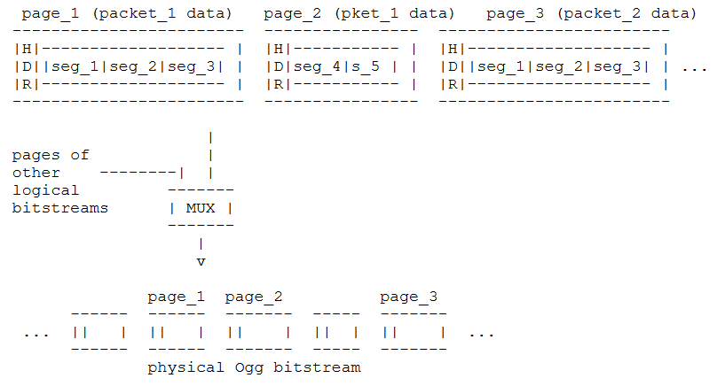

Ogg format
## 1. Definitions
The result of an Ogg encapsulation is called the "Physical (Ogg) Bitstream".  It encapsulates one or several encoder-created bitstreams, which are called "Logical Bitstreams".  A logical bitstream, provided to the Ogg encapsulation process, has a structure, i.e., it is split up into a sequence of so-called "Packets".
## 2. The Ogg bitstream format
A physical Ogg bitstream consists of multiple logical bitstreams interleaved in so-called "Pages".  Whole pages are taken in order from multiple logical bitstreams multiplexed at the page level.  The logical bitstreams are identified by a unique serial number in the header of each page of the physical bitstream.
   
Each Ogg page contains only one type of data as it belongs to one logical bitstream only.
**Each logical bitstream in a physical Ogg bitstream starts with a special start page (bos=beginning of stream) and ends with a special page (eos=end of stream)**
### 2.1 BOS page structure
The bos page contains information to uniquely identify the codec type and MAY contain information to set up the decoding process and information about the encoded media - for example, for audio, it should contain the sample rate and number of channels. By convention, **the first bytes of the bos page contain magic data that uniquely identifies the required codec.** The format of the bos page is dependent on the
codec and therefore MUST be given in **the encapsulation specification of that logical bitstream type.**  Ogg also allows but does not require secondary header packets after the bos page for logical bitstreams

**A physical bitstream begins with the bos pages of all logical bitstreams containing one initial header packet per page, followed by the subsidiary header packets of all streams, followed by pages containing data packets.**
### 2.2 Ogg multiplexing
Ogg knows two types of multiplexing: concurrent multiplexing (so-called "Grouping") and sequential multiplexing (so-called "Chaining"). Grouping defines how to interleave several logical bitstreams page-wise in the same physical bitstream. Chaining on the other hand, is defined to provide a simple mechanism to concatenate physical Ogg bitstreams.

In grouping, all bos pages of all logical bitstreams MUST appear together at the beginning of the Ogg bitstream.  The media mapping specifies the order of the initial pages. eos pages for the logical bitstreams need not all occur contiguously.

In chaining, complete logical bitstreams are concatenated.  The bitstreams do not overlap with each other.

The data from the codec comes in order and has position markers (so-called "Granule positions").  Ogg does not have a concept of 'time': it only knows about sequentially increasing, unitless position markers.
## 3. The encapsulation process   
**As Ogg pages have a maximum size of about 64 kBytes, Ogg divides each packet into 255 byte long chunks plus a final shorter chunk.**  These chunks are called "Ogg Segments". A group of contiguous segments is wrapped into a **variable** length page preceded by a header. A segment table in the page header tells about the "Lacing values" (sizes) of the segments included in the page. A flag in the page header tells whether a page contains a packet continued from a previous page.  Note that a lacing value of 255 implies that a second lacing value follows in the packet, and a value of less than 255 marks the end of the packet after that many additional bytes.  A packet of 255 bytes (or a multiple of 255 bytes) is terminated by a lacing value of 0.

The encoding is optimized for speed and the expected case of the majority of packets being between 50 and 200 bytes large.  This is a design justification rather than a recommendation.  This encoding both avoids imposing a maximum packet size as well as imposing minimum overhead on small packets. 


## 4. The Ogg page format
 Pages are of variable size, usually 4-8 kB, maximum 65307 bytes.  A page header contains all the information needed to demultiplex the logical bitstreams out of the physical bitstream and to perform basic error recovery and landmarks for seeking.
 
 As my understanding one page only contains segments from a single packet, but need to be confirmed. 
 

``` newpage
3. header_type_flag: the bits in this 1 Byte field identify the specific type of this page.
  *  bit 0x01
     set: page contains data of a packet continued from the previous page
     unset: page contains a fresh packet
  *  bit 0x02
     set: this is the first page of a logical bitstream (bos)
     unset: this page is not a first page
  *  bit 0x04
     set: this is the last page of a logical bitstream (eos)
     unset: this page is not a last page
8. number_page_segments: 1 Byte giving the number of segment entries encoded in the segment table.
9. segment_table: number_page_segments Bytes containing the lacing values of all segments in this page.  Each Byte contains one lacing value.     
```
 
The total header size in bytes is given by:
header_size = number_page_segments + 27 [Byte]

The total page size in Bytes is given by:
page_size = header_size + sum(lacing_values: 1..number_page_segments) [Byte]